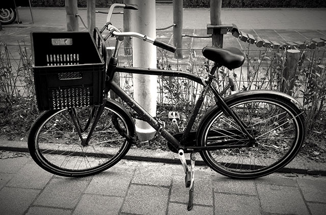

Lieve fiets,

Ik had je ’s ochtends neergezet buiten op de Herengracht. Ik had haast en ik ben niet altijd heel zorgvuldig, maar ik had je goed op slot gezet en gekeken of je niet zomaar in de gracht zou vallen. Toen ik aan het einde van de dag buiten kwam, was je weg.

Ik heb je gezocht waar ik je had achtergelaten en in de buurt bij fietsenrekken en brugleuningen. Ik zag zwarte kratten met stickers erop, soms dezelfde als die jij had, maar ze hoorden bij andere fietsen. Met de tram ging ik naar huis. We reden verder van de Herengracht vandaan, over het Rokin en de Rozengracht. Ik keek naar fietsende mensen en dacht aan de keren dat wij naar de Albert Heijn waren gegaan, of een concert — weet je nog dat we door de stromende regen naar Blijburg waren gefietst, en dat jij een lekke band kreeg op de terugweg?

Misschien ben je in het water gevallen, misschien ben je door iemand meegenomen. Misschien ben je gewoon zelf vertrokken, in je eentje, ook al was je vaak onhandig als ik je niet vasthield.

Ik heb je sleutels nog. Als je ooit terugkomt, hoop ik dat we weer eens samen op weg gaan.

Dag lieve fiets, bedankt
